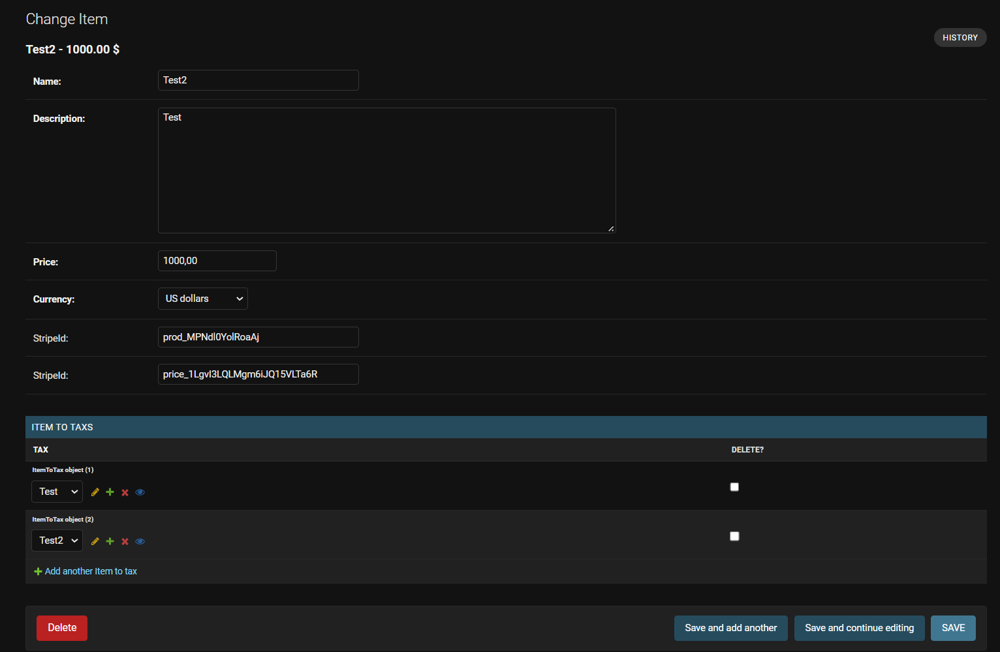

# Документация для администрирование системы

Система имеет стандартное панель администрирование Django.

Кроме стандартных панелей аутентификаций и авторизаций имеется несколько понелей для управления системой.

## Items (Продукты, Товары)

Тут имеется список товаров(продукции), а также мойно отсюда добовлять или редактировать товары.

Отсюда можно присваивать продукту налоговый или НДС наценки.

## Orders (Заказы)

Этот понель для контроля заказов в системе. Тут имеется как и элементы заказа так и пременённие скидки к заказу.

## Discount Coupons (Скидочные купоны)

Панель дня контроля скидочных купонов.

Пока что в системе не учтено непосредственное использование скидочных купонов, но в будущем мойно будет добавить.

## Promo Codes

Панель для контроля скидочных промокодов.

## Taxes

Панель для контроля надбавок к налогу или НДС.

# Документация для использование системы

Система была создана для решения задач указанное в файле `task.md` и красивого внешнего вида, только html с javascript-ами внутри.

В системе учтено 2 типа волюти американские доллары (USD) и российские рубли (RUB) из за чего и в системе имеется 2 карзины, для каждой валюты по отдельности.

Тут можно управлять элементами каждой корзины, а так же мойно создать заказ по каждой из карзин.

А также имеетя таблица активированых промокодов(скидок). 

В этой таблице можно как убрать так и поставить новый промокод.

Система имеет 2 основных и 2 внутренних страницы

## Products page (Главная страница)

В этой странице все продукты(item) катори мойно купить в нашей системе.

Там имеется информация о каждом продукте (название, цена) а такая кнопка **Read more** с помошью катором мойно попаст в стране прадукта (Product Detail Page).

## Orders Page

В этой странице имеется все созданные заказы, а также их id и общая симма заказа.Также имеется кнопка **Read more** для перехода на страницу заказа (Order Detail Page).

## Product Detail Page

Тут имеется подробная информация о продукте.

Также отсюда можно купить этот продукт или добавить в корзину.

## Order Detail Page

Эта страница заказа с подробной информацией о заказе, где имеется все элементы заказа а такое применение скидки к заказу.

Отсюда можно оплатить заказ с помашью кнопки `Pay with Stripe`.

